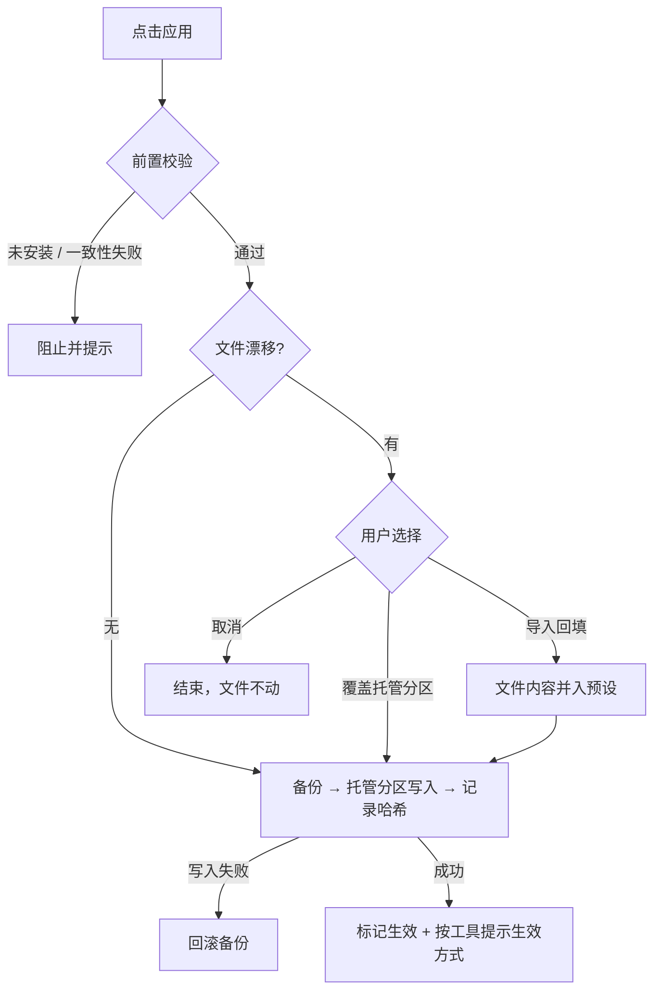
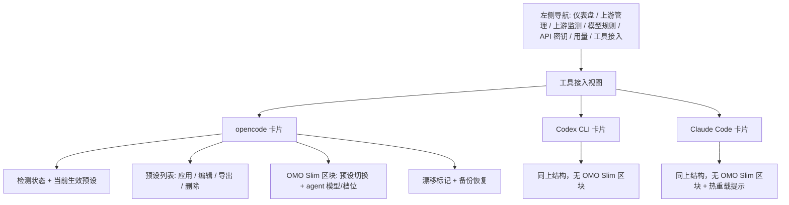

# 工具接入（供应商预设管理） - Plan

## Goal Capsule

- **Objective:** Autoapi 新增"工具接入"能力——为 opencode、Codex CLI、Claude Code 管理供应商预设，并以托管分区方式安全写入各工具配置文件；Autoapi 中转为一等预设类型；opencode 卡片内同时管理 oh-my-opencode-slim 插件配置。
- **Product authority:** 本文档为本工作单元的唯一范围依据；Gemini CLI、MCP 管理、多机同步等周边领域不在本计划范围。
- **Open blockers:** 无。Outstanding Questions 全部为 Deferred to Planning。

---

## Product Contract

### Summary

Autoapi 将新增左侧导航一级入口"工具接入"：为 opencode、Codex CLI、Claude Code 管理供应商预设（含第三方直连与 Autoapi 中转），以托管分区方式写入各工具配置文件并可一键应用/切换。Autoapi 中转预设自动同步 relay 端点、密钥与模型清单。opencode 卡片内同时管理 oh-my-opencode-slim 的预设切换与 agent 模型/档位指派。

### Problem Frame

用户在两台 Mac 上经 Autoapi 中转使用多个编码工具，供应商配置全靠手改各工具的配置文件。这个过程已经被证明是高事故区：opencode 的 variant 静默失效（模型未声明 `reasoning` 导致档位完全不生效）、推理档位被上游默认值覆盖、各工具配置键名与优先级规则互不相同且官方文档分散。每一次排查都要跨二进制逆向、数据库日志与官方文档三头对证。

独立工具 cc-switch 解决了"多套供应商预设切换"，但它不了解 Autoapi 中转——端点、密钥、模型清单都要用户手工保持同步，与模型规则的变化脱节。同时各工具配置文件存在真实的写入风险：Claude Code 会频繁回写自己的配置文件，cc-switch 自己的 v3.11 曾因"部分键合并"造成用户数据丢失并被迫回滚。oh-my-opencode-slim 的 agent 模型/档位指派是另一个手改文件，且其模型引用必须与 opencode.json 的 provider 定义保持一致，目前没有任何工具帮助维持这种一致性。

### Key Decisions

- **混合式预设管理** (session-settled: user-directed — chosen over 纯 Autoapi 闭环 / 完整 cc-switch 复刻: 第三方直连预设也要能管理，Autoapi 中转为一等特殊预设类型). Governs R1, R3, R4
- **托管分区写入，不做全量文件 SSOT** (session-settled: user-approved — chosen over cc-switch 全量覆盖+共享片段模式: 保住文件内非托管自定义；cc-switch v3.11 部分合并回滚的教训). Governs R6, R7, R10
- **v1 覆盖 opencode + Codex CLI + Claude Code** (session-settled: user-directed — chosen over 包含 Gemini CLI: Gemini 无文档化的通用端点覆盖机制). Governs R11, R12, R13
- **漂移检测 + 手动决定** (session-settled: user-directed — chosen over 静默覆盖 / 自动双向同步: 任何自动策略都有数据丢失面). Governs R8, R9
- **左侧导航一级入口"工具接入"** (session-settled: user-approved — chosen over 设置页分区 / 上游管理 tab: 高频操作需要可发现性；上游出口与客户端入口心智分离). Governs R16
- **OMO Slim 作为 opencode 卡片内第二受管文件** (session-settled: user-approved — chosen over 独立工具卡片: agent 模型引用必须与 opencode provider 一致，同卡片便于跨文件校验). Governs R14
- **远程机器仅导出接入片段** (session-settled: user-approved — chosen over 远程写入: 本机文件系统边界，第二台 Mac 手工粘贴). Governs R15
- **密钥库内 AES 加密、写盘明文；env 引用模式后置** (session-settled: user-approved — 目标工具生态普遍要求明文落盘；`{env:VAR}` 等引用模式列为后续增强). Governs R2

### Actors

- A1. 用户（单机或双 Mac 场景的唯一操作者）
- A2. Autoapi 桌面应用（预设存储、检测、写入与校验的执行者）
- A3. 目标编码工具（opencode / Codex CLI / Claude Code；其配置文件为被写对象，部分工具会回写）

### Requirements

**预设数据与存储**

- R1. 每个工具可维护多套供应商预设：名称、供应商/协议类型、端点 baseURL、API 密钥、模型清单；opencode 预设的模型清单支持模型级属性（名称、limit、modalities、reasoning、variants 覆盖）。
- R2. 预设密钥在 Autoapi 数据库内 AES-256-GCM 加密存储（复用现有加密设施），仅在写入工具文件或导出片段时解密。
- R3. 每个工具同一时刻至多一个"当前生效"预设；应用动作将预设写入工具配置文件并记录生效状态。

**Autoapi 中转预设**

- R4. 内置 Autoapi 中转预设类型：端点自动取当前 relay 地址并跟随端口/绑定变更，密钥从已有 api_keys 选择或引导新建，模型清单默认取全部已启用模型规则且可按预设裁剪子集。

**检测与写入安全**

- R5. 检测各工具的安装与配置文件存在性；未安装时卡片明示状态并禁用应用动作。
- R6. 应用即托管分区读改写：适配器仅写入其拥有的键，文件其余内容（未知键、注释、格式风格）原样保留；落盘为原子写入（临时文件 + rename）。
- R7. 每次写入前自动备份原文件，提供查看与恢复入口。
- R8. 每次成功应用后记录文件哈希；文件被外部修改（手改或工具回写）时在卡片标记"已被外部修改"。
- R9. 漂移状态下用户可选择：以预设覆盖托管分区 / 将文件当前内容导入回填到预设（更新当前或存为新预设）/ 取消；系统不做自动合并、不做自动覆盖。
- R10. 写入任一阶段失败时回滚到写入前状态，文件保持原样可用，并展示可读错误。

**工具适配**

- R11. opencode：管理 `provider` 下自有条目（`@ai-sdk/openai-compatible` 与 `@ai-sdk/openai` 两种形态）及顶层 `model` 指针；不触碰 `auth.json`、`mcp`、`agent`、`plugin` 等其余键。
- R12. Codex CLI：管理 `model_providers` 自有表项与 `model_provider`/`model` 选择；密钥落点遵循工具惯例，具体方式在规划中确定。
- R13. Claude Code：仅注入 `env` 块的 `ANTHROPIC_BASE_URL` / `ANTHROPIC_AUTH_TOKEN` / `ANTHROPIC_MODEL` 与顶层 `model`；应用成功后明示热重载即时生效。
- R14. OMO Slim（opencode 卡片内第二受管文件）：激活预设切换、8 个内置 agent 与自定义 agent 的 model/variant 指派、`disabled_agents` 开关；variant 输入带下拉建议（来自 opencode.json 自定义 variants 与已验证的内置解析规则）并允许自由输入；应用前校验 agent 的 model 存在于 opencode provider 模型清单，缺失则阻止并指出；若 `.jsonc` 变体存在则以它为准并保留注释改写；skills/mcps 数组与 prompt 内容不在 v1 编辑面内，原样保留。

**导出**

- R15. 每个预设可导出接入片段（对应工具的配置文本与目标路径说明），供其他机器手工粘贴；导出为只读生成，不做任何远程写入。

**界面与文案**

- R16. 左侧导航新增一级入口"工具接入"（含图标与 i18n 键），路由到独立视图。
- R17. 视图按工具分卡片：检测状态、预设列表、当前生效预设、应用/切换、漂移标记、备份恢复、导出；OMO Slim 作为 opencode 卡片内的第二区块。
- R18. 全部文案经 i18n（zh-CN 默认、en-US 补齐）。

**质量**

- R19. 每个适配器的读改写、备份、回滚、漂移检测有单元测试（临时目录构造工具配置文件）。
- R20. 应用 Autoapi 中转预设后，可经现有模型测试链路验证连通性。

### Key Flows

- F1. 应用预设
  - **Trigger:** 用户在工具卡片点击"应用"。
  - **Actors:** A1, A2, A3
  - **Steps:** 前置校验（工具已安装；OMO Slim 跨文件一致性）→ 漂移检查（有漂移走 F2）→ 备份 → 托管分区写入 → 原子落盘 → 记录哈希与生效预设 → 按工具提示生效方式（重启 / 热重载）。
  - **Covers R3, R5, R6, R7, R10, R11, R12, R13, R14**
- F2. 漂移处理
  - **Trigger:** 检测到文件哈希与上次应用记录不一致。
  - **Actors:** A1, A2, A3
  - **Steps:** 卡片标记"已被外部修改" → 用户点应用时三选：覆盖托管分区 / 导入回填 / 取消 → 按选择执行。
  - **Covers R8, R9**
- F3. 导出接入片段
  - **Trigger:** 用户在预设上点"导出"。
  - **Actors:** A1, A2
  - **Steps:** 生成该工具对应的配置文本与目标路径说明 → 复制或下载 → 用户到其他机器手工粘贴。
  - **Covers R15**

### View Layout

### Acceptance Examples

- AE1. **Covers R5.** 工具未安装 → 卡片显示"未检测到安装"，应用/切换禁用。
- AE2. **Covers R8, R9.** 应用时发现漂移 → 弹出覆盖/导入/取消三选；选取消则文件完全不动。
- AE3. **Covers R13.** Claude Code 应用成功 → 提示"配置已热重载，运行中的会话即刻生效"。
- AE4. **Covers R14.** 存在 `.jsonc` 变体 → 写回 `.jsonc` 且注释与格式风格保留。
- AE5. **Covers R14.** OMO Slim agent 的 model 不在 opencode provider 清单 → 应用被阻止并指出缺失的模型引用。
- AE6. **Covers R10.** 写入中途失败（如权限错误）→ 文件回滚至写入前内容，错误对用户可见。
- AE7. **Covers R2.** 预设密钥在 Autoapi 数据库中落盘为密文；仅在写入工具文件或导出时解密。

### Success Criteria

- 应用 Autoapi 中转预设后，目标工具能经 relay 完成一次真实请求（chat 与 responses 协议至少各一）。
- 应用/切换/回滚全流程下，配置文件内非托管内容零丢失（由测试固化）。
- 外部修改 100% 被检出并标记（哈希比对，无静默）。
- 用户无需离开 Autoapi 即可完成"从预设到工具可用"的闭环；远程机器经导出片段可达同等效果。

### Scope Boundaries

**Deferred for later**

- Gemini CLI 及更多工具（Grok、OpenClaw、Hermes 等）适配。
- OMO Slim 的 skills/mcps 数组编辑与 markdown 提示词文件管理。
- MCP/插件/Skills 跨工具管理（cc-switch 式）。
- 密钥 env 引用模式（`{env:VAR}`、`env_key`、`apiKeyHelper`）。
- 多机配置同步与远程写入。

**Outside this product's identity**

- 用量查询、速度测试、托盘快捷切换等 cc-switch 式外围能力。
- 对工具配置文件的全量托管——用户非托管内容永不被覆盖。

### Dependencies / Assumptions

- 各工具配置格式与端点注入方式以 2026-07 官方文档为准（见 Sources）；目标工具升级改动格式时适配器需跟进。
- opencode 与 Codex 无配置文件热重载，应用后需重启/新会话生效——官方文档未明示，按待验证假设处理，UI 提示以此为准。
- Claude Code 会频繁回写 `settings.json`（`/config`、权限批准）——对该工具，漂移标记属常态而非异常，UI 文案需避免报警疲劳。
- 本功能读写用户主目录下的工具配置文件（`~/.config/opencode/`、`~/.codex/`、`~/.claude/`），是仓库首次访问 `~/.autoapi/` 之外的路径。

### Outstanding Questions

**Deferred to Planning**

- Codex 密钥落点：写 `auth.json`（cc-switch 做法）还是 `env_key` 环境变量引用（官方推荐）。
- 备份保留份数与存放位置。
- variant 建议规则的维护策略（opencode 内置解析规则随版本演进，如何避免腐化）。
- OMO Slim `.jsonc` 保注释改写的实现选型（注释保留解析库 vs 文本区间替换）。

### Sources / Research

- cc-switch 源码调研（farion1231/cc-switch v3.18.0，克隆于 `/tmp/cc-switch`）：原子写入 `src-tauri/src/config.rs:297-352`；v3.11 部分键合并回滚教训；各工具写入策略（Codex 两阶段写 auth+config、Gemini `.env` 权限 600、Grok `toml_edit` 插入式、Hermes YAML 段落替换+备份）。
- 官方配置文档：opencode（`opencode.ai/docs/config`、`/docs/providers`——managed settings、`{env:}`/`{file:}` 语法、auth.json 分离）；Codex（`learn.chatgpt.com/codex` config-basic/config-advanced/config-reference——`model_providers` 表结构、`wire_api="responses"`）；Claude Code（`code.claude.com/docs/en/settings`、`/env-vars`——热重载、受管设置、env 块注入）；Gemini CLI（`google-gemini.github.io/gemini-cli`——无通用端点覆盖，v1 暂缓依据）。
- OMO Slim 本地技能文档（`~/.config/opencode/skills/oh-my-opencode-slim/`）与用户实际配置（`~/.config/opencode/oh-my-opencode-slim.json`：preset kimi/openai 双预设、database/fast-generic 自定义 agent）。
- 仓库集成点（已逐一验证）：迁移追加点 `internal/store/migrations.go:594-598`（下一 id 037）；settings 7 分区模式 `internal/store/settings.go:35-49,77-85`；AES 加密设施 `internal/service/service.go:280-327`；relay 地址解析 `internal/service/service.go:212-238`；api_keys 鉴权 `internal/proxy/proxy.go:609-632`；导航注册 `frontend/src/components/SidebarNav.vue:16-23`；存储测试模式 `internal/store/store_test.go:65-79`；wails 绑定再生流程 `frontend/src/api/bridge.ts`。
